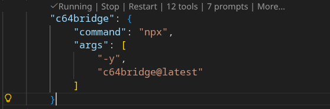
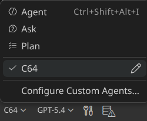

# C64 Bridge


Your AI Command Bridge for the Commodore 64.

[](https://www.npmjs.com/package/c64bridge)
[](https://github.com/chrisgleissner/c64bridge/actions/workflows/ci.yaml)
[](https://codecov.io/github/chrisgleissner/c64bridge)
[](https://www.gnu.org/licenses/old-licenses/gpl-2.0.en.html)
[](doc/developer.md)

C64 Bridge is a Model Context Protocol ([MCP](https://modelcontextprotocol.io/docs/getting-started/intro)) server for controlling a real Commodore 64 Ultimate or Ultimate 64, and for switching into a VICE emulator session when you want emulator-backed workflows in the same MCP conversation.

It is built on the official TypeScript `@modelcontextprotocol/sdk` and supports both `stdio` for local AI integration and an optional HTTP bridge for manual inspection.

## Contents

- [C64 Bridge](#c64-bridge)
  - [Contents](#contents)
  - [Overview](#overview)
  - [Features](#features)
  - [Quick Start](#quick-start)
    - [1. Install Node.js 24+ and npm](#1-install-nodejs-24-and-npm)
    - [2. Start the Server](#2-start-the-server)
    - [3. Add Backend Configuration](#3-add-backend-configuration)
    - [4. Connect from an MCP Client](#4-connect-from-an-mcp-client)
  - [Configuration](#configuration)
    - [Configuration File Order](#configuration-file-order)
    - [Configuration Merge Rules](#configuration-merge-rules)
    - [Backend Configuration: C64 Ultimate](#backend-configuration-c64-ultimate)
    - [Backend Configuration: VICE](#backend-configuration-vice)
    - [Runtime Backend Switching](#runtime-backend-switching)
  - [VS Code MCP Setup](#vs-code-mcp-setup)
    - [Enable the C64 Agent](#enable-the-c64-agent)
    - [Optional Overrides](#optional-overrides)
    - [Environment Variables in MCP Client Configs](#environment-variables-in-mcp-client-configs)
    - [Runtime Environment Variable Reference](#runtime-environment-variable-reference)
      - [Server Runtime](#server-runtime)
      - [C64 Ultimate](#c64-ultimate)
      - [VICE Runtime](#vice-runtime)
      - [VICE Audio Capture](#vice-audio-capture)
      - [SID Playback](#sid-playback)
      - [RAG](#rag)
      - [Testing](#testing)
  - [Example Workflow](#example-workflow)
  - [HTTP Invocation](#http-invocation)
  - [Build and Test](#build-and-test)
  - [Documentation](#documentation)
  - [Static MCP Interface](#static-mcp-interface)
  - [MCP API Reference](#mcp-api-reference)
    - [Tools](#tools)
      - [c64\_config](#c64_config)
      - [c64\_debug](#c64_debug)
      - [c64\_disk](#c64_disk)
      - [c64\_drive](#c64_drive)
      - [c64\_extract](#c64_extract)
      - [c64\_graphics](#c64_graphics)
      - [c64\_memory](#c64_memory)
      - [c64\_printer](#c64_printer)
      - [c64\_program](#c64_program)
      - [c64\_rag](#c64_rag)
      - [c64\_select\_backend](#c64_select_backend)
      - [c64\_sound](#c64_sound)
      - [c64\_stream](#c64_stream)
      - [c64\_system](#c64_system)
      - [c64\_vice](#c64_vice)
    - [Resources](#resources)
    - [Prompts](#prompts)

## Overview

C64 Bridge gives an AI agent one place to drive program execution, memory access, graphics, sound, storage, printer workflows, and knowledge retrieval for a Commodore 64 environment.

The core workflow is simple:

1. Start the MCP server.
2. Point it at C64 Ultimate hardware, VICE, or both.
3. Let the client call grouped MCP tools such as `c64_program`, `c64_memory`, `c64_graphics`, and `c64_sound`.
4. Switch backends at runtime with `c64_select_backend` when both are configured.

## Features

- Program runners for BASIC, 6510 assembly, and PRG or CRT execution
- Full memory access, including raw reads and writes plus screen polling
- System integration for drives, files, printers, and task orchestration
- SID music tools for playback, composition, generation, and verification
- Built-in knowledge resources and prompts for safer LLM workflows
- Mixed runtime support for hardware `c64u` and emulator `vice`

## Quick Start

If you want the shortest path, do these four things:

1. Install Node.js 24+ and npm.
2. Start the server.
3. Add backend configuration for C64 Ultimate, VICE, or both.
4. Connect from VS Code or another MCP client.

### 1. Install Node.js 24+ and npm

Linux (Ubuntu or Debian):

Recommended:

```bash
sudo apt update
sudo apt install -y curl ca-certificates
curl -fsSL https://deb.nodesource.com/setup_24.x | sudo -E bash -
sudo apt install -y nodejs
```

Fallback:

```bash
sudo apt install -y nodejs npm
```

macOS:

```bash
brew install node@24
brew link --overwrite node@24
```

Windows:

```powershell
# winget
winget install OpenJS.NodeJS.LTS
# or Chocolatey
choco install nodejs-lts -y
```

Verify the installation:

```bash
node --version
```

Expected result: `v24.x`

### 2. Start the Server

Use one of the following entry points.

Run from `npx` with zero setup:

```bash
npx -y c64bridge@latest
```

Run from a local npm install:

```bash
mkdir -p ~/c64bridge && cd ~/c64bridge
npm init -y
npm install c64bridge
node ./node_modules/c64bridge/dist/index.js
```

Run from source for development or testing:

```bash
git clone https://github.com/chrisgleissner/c64bridge.git
cd c64bridge
./build install
npm start
```

On startup, the server probes the selected target, performs connectivity checks, and then announces that it is running on stdio.

### 3. Add Backend Configuration

The server can run against:

- only C64 Ultimate hardware
- only VICE
- both backends in one session, with runtime switching

The detailed lookup order, merge rules, backend examples, and override model are in the [Configuration](#configuration) section below.

### 4. Connect from an MCP Client

If you use VS Code, follow the [VS Code MCP Setup](#vs-code-mcp-setup) section below.

If you use another MCP client, point it at the `stdio` server entry point and pass any required environment variables exactly as documented in this README and in [mcp.json](./mcp.json).

## Configuration

### Configuration File Order

The server reads configuration in this order:

1. `C64BRIDGE_CONFIG`, if it points to a config file
2. `.c64bridge.json` in the project root
3. `~/.c64bridge.json` in the home directory

### Configuration Merge Rules

Configuration is merged per backend section while scanning those files in order.

- The first file that contains a `c64u` section supplies the C64 Ultimate configuration.
- The first file that contains a `vice` section supplies the VICE configuration.
- This allows a project-local `.c64bridge.json` to define `c64u` while `~/.c64bridge.json` defines `vice`, with both backends available at runtime.

### Backend Configuration: C64 Ultimate

Use this for a C64 Ultimate or Ultimate 64:

```json
{
  "c64u": {
    "host": "c64u",
    "port": 80,
    "networkPassword": "secret"
  }
}
```

- If no file is found, the default target is `c64u:80` with no network password.
- `networkPassword` is only needed when you enabled a password in the C64 Ultimate network settings.
- `C64U_HOST`, `C64U_PORT`, and `C64U_PASSWORD` override the configured host, port, and network password.

### Backend Configuration: VICE

Use this for managed VICE launches:

```json
{
  "vice": {
    "exe": "/usr/bin/x64sc",
    "directory": "/usr/local/share/vice"
  }
}
```

- `directory` is optional. When omitted, C64 Bridge auto-detects a VICE resource directory by looking for the standard C64 ROM set near the emulator binary and in common system locations.
- `VICE_BINARY`, `VICE_DIRECTORY`, `VICE_HOST`, `VICE_PORT`, `VICE_VISIBLE`, `VICE_WARP`, and `VICE_ARGS` override managed VICE startup without editing config files.
- If no explicit binary is configured, the runtime prefers `/usr/local/bin/x64sc` when present, then falls back to `x64sc` or `x64` on `PATH` so the same setup remains portable across operating systems.

> [!NOTE]
> VICE supports only the operations marked with a VICE checkmark in the [MCP API Reference](#mcp-api-reference). Unsupported operations return `unsupported_platform`.

### Runtime Backend Switching

When both `c64u` and `vice` are configured, C64 Bridge starts with one active backend and keeps the other available for runtime switching.

- `C64_MODE` chooses the initial backend: `c64u` or `vice`
- `c64_select_backend` switches backends without restarting the MCP server
- `c64://platform/status` reports the active backend and the full configured backend set
- In prompts, say things like `use vice`, `vice: run this program`, `use c64u`, or `run this on the real machine`
- In VS Code, include the backend preference in the same prompt when you want to force emulator versus hardware execution

Prompt illustration (issued via Copilot in VS Code, using GPT 5.4 Medium):

```text
c64u: write a small BASIC program that clears the screen and prints HELLO C64U
vice: write a small BASIC program that clears the screen and prints HELLO VICE
```

The screenshots below were captured from actual backend bitmap responses after those prompts ran, using the same `c64_graphics` `capture_frame` MCP tool on both backends. The C64U implementation captures streamed video frames, while the VICE implementation captures and normalizes the emulator display frame. Both images were then verified optically against the expected text with the C64 character generator, and both matched exactly.

| Backend | Screenshot |
| --- | --- |
| C64 Ultimate |  |
| VICE |  |

## VS Code MCP Setup

If this repository is checked out locally, open the prepared [.vscode/mcp.json](./.vscode/mcp.json).

Otherwise, put the following into your own `.vscode/mcp.json`:

```json
{
  "servers": {
    "c64bridge": {
      "command": "npx",
      "args": [
        "-y",
        "c64bridge@latest"
      ]
    }
  }
}
```

Then click the start button shown above the `c64bridge` entry.

Your MCP server should now be running:



For more details, see the official [VS Code MCP Server documentation](https://code.visualstudio.com/docs/copilot/customization/mcp-servers).

### Enable the C64 Agent

After the server is running, switch to the `C64` agent in VS Code.

This agent is preconfigured for Commodore 64 work. It steers Copilot toward `c64bridge` workflows for BASIC, 6502 assembly, SID audio, VIC-II graphics, memory inspection, disk operations, printing, streaming, and device control.



### Optional Overrides

You can add `env` entries in `.vscode/mcp.json` to select a config file, override C64 Ultimate connection details, or force an initial backend:

```json
{
  "servers": {
    "c64bridge": {
      "command": "npx",
      "args": [
        "-y",
        "c64bridge@latest"
      ],
      "env": {
        "C64BRIDGE_CONFIG": "/home/you/.c64bridge.json",
        "C64U_HOST": "192.168.1.99",
        "C64U_PORT": "80",
        "C64U_PASSWORD": "secret",
        "C64_MODE": "c64u",
        "LOG_LEVEL": "debug"
      }
    }
  }
}
```

- `C64BRIDGE_CONFIG` points to a specific config file
- `C64U_HOST`, `C64U_PORT`, and `C64U_PASSWORD` override the C64 Ultimate connection without editing config files
- `C64_MODE` forces the initial backend to `c64u` or `vice`
- `LOG_LEVEL=debug` enables verbose logging

### Environment Variables in MCP Client Configs

Every runtime environment variable documented in the root [mcp.json](./mcp.json) can be supplied by your MCP client configuration, including `.vscode/mcp.json` under `servers.c64bridge.env`.

When an environment variable maps to a JSON config field, the override order is always:

1. the explicit environment variable from your MCP client config or shell
2. the merged JSON config section loaded from `C64BRIDGE_CONFIG`, the repo `.c64bridge.json`, then `~/.c64bridge.json`
3. the built-in default compiled into the server

When an environment variable has no JSON config equivalent, the order is:

1. the explicit environment variable from your MCP client config or shell
2. the built-in default

That rule applies uniformly across the documented runtime environment variables below.

Example: visible VICE with a specific ROM or resource directory, plus a hardware fallback that can still be selected instantly at runtime:

```json
{
  "servers": {
    "c64bridge": {
      "command": "node",
      "args": ["${workspaceFolder}/scripts/start.mjs"],
      "type": "stdio",
      "env": {
        "C64_MODE": "vice",
        "C64U_HOST": "c64u",
        "C64U_PORT": "80",
        "VICE_BINARY": "/usr/local/bin/x64sc",
        "VICE_DIRECTORY": "/usr/local/share/vice",
        "VICE_VISIBLE": "true",
        "VICE_WARP": "false"
      }
    }
  }
}
```

Example: keep JSON config files for backend endpoints, but override diagnostics, polling, and RAG behavior from VS Code:

```json
{
  "servers": {
    "c64bridge": {
      "command": "node",
      "args": ["${workspaceFolder}/scripts/start.mjs"],
      "type": "stdio",
      "env": {
        "C64BRIDGE_CONFIG": "/home/you/.c64bridge.json",
        "LOG_LEVEL": "debug",
        "C64BRIDGE_POLL_MAX_MS": "8000",
        "C64BRIDGE_POLL_INTERVAL_MS": "200",
        "RAG_BUILD_ON_START": "1",
        "RAG_EMBEDDINGS_DIR": "/home/you/c64bridge-data"
      }
    }
  }
}
```

### Runtime Environment Variable Reference

<!-- AUTO-GENERATED:ENV-VARS-START -->

Every runtime environment variable documented in `mcp.json` can be set in your MCP client configuration, including `.vscode/mcp.json` under `servers.c64bridge.env`.

#### Server Runtime

| Variable | Default | JSON Config Key | Description |
| --- | --- | --- | --- |
| `C64_MODE` | c64u | — | Select active backend (c64u for Ultimate hardware, vice for emulator) |
| `C64_TASK_STATE_FILE` | auto | — | Override the path used to persist MCP background-task state |
| `C64BRIDGE_CONFIG` | ~/.c64bridge.json | config path | Path to configuration JSON |
| `C64BRIDGE_DIAGNOSTICS_DIR` | ~/.c64bridge/diagnostics | — | Override the directory where persistent MCP diagnostics files are written |
| `C64BRIDGE_DISABLE_DIAGNOSTICS` | 0 | — | Set to 1 to disable persistent diagnostics logging |
| `C64BRIDGE_POLL_INTERVAL_MS` | 200 | — | Interval between screen polls during program-output validation in normal runtime mode |
| `C64BRIDGE_POLL_MAX_MS` | 2000 | — | Maximum time to poll for program-output validation before timing out in normal runtime mode |
| `C64BRIDGE_POLL_STABILIZE_MS` | 100 | — | Extra settle time after a successful poll match before considering output stable |
| `LOG_LEVEL` | info | — | Logger verbosity (debug, info, warn, error) |

#### C64 Ultimate

| Variable | Default | JSON Config Key | Description |
| --- | --- | --- | --- |
| `C64U_HOST` | c64u | c64u.host | Override the C64 Ultimate host name or IP address |
| `C64U_PASSWORD` |  | c64u.networkPassword | Override the C64 Ultimate network password sent as X-Password |
| `C64U_PORT` | 80 | c64u.port | Override the C64 Ultimate REST port |

#### VICE Runtime

| Variable | Default | JSON Config Key | Description |
| --- | --- | --- | --- |
| `DISABLE_XVFB` | 0 | — | Set to 1 to disable Xvfb fallback and use the current display only |
| `FORCE_XVFB` | 0 | — | Set to 1 to force managed VICE launches to run under Xvfb |
| `VICE_ARGS` |  | vice.args | Extra command-line arguments forwarded to managed VICE launches |
| `VICE_BINARY` | x64sc | vice.exe | VICE binary to launch for managed emulator sessions and audio capture |
| `VICE_DIRECTORY` | auto-detect | vice.directory | Override the VICE resource directory used for ROM and UI asset discovery |
| `VICE_HOST` | 127.0.0.1 | vice.host | Override the VICE Binary Monitor host |
| `VICE_PORT` | 6502 | vice.port | Override the VICE Binary Monitor port |
| `VICE_VISIBLE` | true | vice.visible | Launch VICE visibly on the desktop instead of headless/Xvfb when possible |
| `VICE_WARP` | false when visible, true when headless | vice.warp | Enable warp mode for managed VICE sessions |
| `VICE_XVFB_DISPLAY` | :99 | — | Display number to use when managed VICE launches under Xvfb |

#### VICE Audio Capture

| Variable | Default | JSON Config Key | Description |
| --- | --- | --- | --- |
| `VICE_LIMIT_CYCLES` | 120000000 | — | Maximum CPU cycles to render when VICE generates audio |
| `VICE_MODE` | ntsc | — | Default video standard for VICE audio capture (ntsc\|pal) |
| `VICE_RUN_TIMEOUT_MS` | 10000 | — | Timeout for headless VICE runs in milliseconds |

#### SID Playback

| Variable | Default | JSON Config Key | Description |
| --- | --- | --- | --- |
| `SIDPLAY_BINARY` | sidplayfp | — | sidplayfp binary to launch when generating audio |
| `SIDPLAY_LIMIT_CYCLES` | 120000000 | — | Maximum CPU cycles to render when sidplayfp generates audio |
| `SIDPLAY_MODE` | ntsc | — | Default SID playback mode (ntsc\|pal) |
| `SIDPLAYFP_BINARY` |  | — | Legacy alias for SIDPLAY_BINARY (sidplayfp executable name) |

#### RAG

| Variable | Default | JSON Config Key | Description |
| --- | --- | --- | --- |
| `GITHUB_TOKEN` |  | — | Personal access token used for optional RAG discovery against GitHub |
| `RAG_BUILD_ON_START` | 0 | — | Set to 1 to rebuild embeddings on server start |
| `RAG_DISCOVER_FORCE_REFRESH` | 0 | — | Set to 1 to ignore cached discovery results when fetching external docs |
| `RAG_DOC_FILES` |  | — | Comma-separated extra docs to include in RAG |
| `RAG_EMBEDDINGS_DIR` | data | — | Directory containing RAG embedding JSON files |
| `RAG_REINDEX_INTERVAL_MS` | 0 | — | Periodic reindex interval in ms (0 disables) |

#### Testing

| Variable | Default | JSON Config Key | Description |
| --- | --- | --- | --- |
| `C64_TEST_TARGET` |  | — | Overrides integration tests to hit mock or real hardware (mock\|real) |

<!-- AUTO-GENERATED:ENV-VARS-END -->

## Example Workflow

Compose a children’s song with ChatGPT and VS Code:


Then render PETSCII art for it:


This is representative of the intended workflow:

1. Ask the MCP client to generate or refine C64-oriented content.
2. Use grouped tools such as `c64_program`, `c64_graphics`, and `c64_sound` to execute it.
3. Verify the result via screen reads, frame capture, memory inspection, or audio analysis.

## HTTP Invocation

- Preferred transport is `stdio`.
- The HTTP bridge is disabled by default and is intended only for manual testing.
- The following curl commands are illustrative so you can see what grouped MCP calls look like over HTTP.

```bash
# Upload and run BASIC
curl -s -X POST -H 'Content-Type: application/json' \
  -d '{"op":"upload_run_basic","program":"10 PRINT \"HELLO\"\n20 GOTO 10"}' \
  http://localhost:8000/tools/c64_program | jq

# Read current screen (PETSCII→ASCII)
curl -s -X POST -H 'Content-Type: application/json' \
  -d '{"op":"read_screen"}' \
  http://localhost:8000/tools/c64_memory | jq

# Reset the machine
curl -s -X POST -H 'Content-Type: application/json' \
  -d '{"op":"reset"}' \
  http://localhost:8000/tools/c64_system
```

## Build and Test

The [`./build`](./build) script at the project root wraps all development tasks behind a single, self-documented interface:

```bash
./build --help                                       # full command reference
./build                                              # install + build + test matrix (full CI run)
./build --skip-tests                                 # install + build only
./build build                                        # TypeScript compile + doc generation
./build test                                         # integration tests (mock backend)
./build test --real                                  # test against real hardware
./build test --platform vice --target mock           # single test leg
./build test:matrix                                  # full matrix (c64u/mock · vice/mock · vice/device)
./build coverage                                     # merged coverage report
./build coverage:single --platform c64u --target mock
./build check                                        # build + test matrix (no install)
./build rag:rebuild                                  # rebuild RAG embeddings
./build release --version 1.2.3                      # prepare a release
```

> **Starting the MCP server** is not managed by `./build`. Use `npm start` (from source) or `npx -y c64bridge@latest` (published package) as shown in the [Quick Start](#quick-start) section above.

## Documentation

- [doc/developer.md](doc/developer.md) — development workflow and RAG details
- [data/context/bootstrap.md](data/context/bootstrap.md) — primer injected ahead of prompts
- [doc/c64u/c64-openapi.yaml](doc/c64u/c64-openapi.yaml) — REST surface (OpenAPI 3.1)
- [AGENTS.md](AGENTS.md) — LLM-facing quick setup, usage, and personas

## Static MCP Interface

The repository contains an auto-generated static mirror of the MCP server interface in the [./mcp](./mcp) folder.

This allows agents to inspect the available tools, resources, prompts, and schemas without connecting to the server.

## MCP API Reference

<!-- AUTO-GENERATED:MCP-DOCS-START -->

This MCP server exposes **15 tools**, **26 resources**, and **10 prompts** for controlling your Commodore 64.

### Tools

#### c64_config

Grouped entry point for configuration reads/writes, diagnostics, and snapshots.

| Operation | Description | Required Inputs | Notes | C64U | VICE |
| --- | --- | --- | --- | --- | --- |
| `batch_update` | Apply multiple configuration updates in a single request. | — | — | ✅ | ✅ |
| `diff` | Compare the current configuration with a snapshot. | `path` | — | ✅ | ✅ |
| `get` | Read a configuration category or specific item. | `category` | — | ✅ | ✅ |
| `info` | Retrieve Ultimate hardware information and status. | — | — | ✅ | ✅ |
| `list` | List configuration categories reported by the firmware. | — | — | ✅ | ✅ |
| `load_flash` | Load configuration from flash storage. | — | — | ✅ |  |
| `read_debugreg` | Read the Ultimate debug register ($D7FF). | — | — | ✅ |  |
| `reset_defaults` | Reset firmware configuration to factory defaults. | — | — | ✅ |  |
| `restore` | Restore configuration from a snapshot file. | `path` | — | ✅ | ✅ |
| `save_flash` | Persist the current configuration to flash storage. | — | — | ✅ |  |
| `set` | Write a configuration value in the selected category. | `category`, `item`, `value` | — | ✅ | ✅ |
| `shuffle` | Discover PRG/CRT files and run each with optional screen capture. | — | — | ✅ |  |
| `snapshot` | Snapshot configuration to disk for later restore or diff. | `path` | — | ✅ | ✅ |
| `version` | Fetch firmware version details. | — | — | ✅ | ✅ |
| `write_debugreg` | Write a hex value to the Ultimate debug register ($D7FF). | `value` | — | ✅ |  |

#### c64_debug

Grouped entry point for VICE debugger operations (breakpoints, registers, stepping).

| Operation | Description | Required Inputs | Notes | C64U | VICE |
| --- | --- | --- | --- | --- | --- |
| `create_checkpoint` | Create a new checkpoint (breakpoint) in VICE. | `address` | — |  | ✅ |
| `delete_checkpoint` | Remove a checkpoint by id. | `id` | — |  | ✅ |
| `get_checkpoint` | Fetch a single checkpoint by id. | `id` | — |  | ✅ |
| `get_registers` | Read register values, optionally filtered by name or id. | — | — |  | ✅ |
| `list_checkpoints` | List all active VICE checkpoints (breakpoints). | — | — |  | ✅ |
| `list_registers` | List available registers (metadata). | — | — |  | ✅ |
| `set_condition` | Attach a conditional expression to a checkpoint. | `id`, `expression` | — |  | ✅ |
| `set_registers` | Write register values. | `writes` | — |  | ✅ |
| `step` | Single-step CPU execution. | — | — |  | ✅ |
| `step_return` | Continue execution until the current routine returns. | — | — |  | ✅ |
| `toggle_checkpoint` | Enable or disable a checkpoint by id. | `id`, `enabled` | — |  | ✅ |

#### c64_disk

Grouped entry point for disk mounts, listings, image creation, and program discovery.

| Operation | Description | Required Inputs | Notes | C64U | VICE |
| --- | --- | --- | --- | --- | --- |
| `create_image` | Create a blank disk image of the specified format. | `format`, `path` | — | ✅ |  |
| `file_info` | Inspect metadata for a file on the Ultimate filesystem. | `path` | — | ✅ |  |
| `find_and_run` | Search for a PRG/CRT by name substring and run the first match. | `nameContains` | — | ✅ |  |
| `list_drives` | List Ultimate drive slots and their mounted images. | — | — | ✅ | ✅ |
| `mount` | Mount a disk image with optional verification and retries. | `drive`, `image` | supports verify | ✅ | ✅ |
| `unmount` | Remove the mounted image from an Ultimate drive slot. | `drive` | — | ✅ | ✅ |

#### c64_drive

Grouped entry point for drive power, mode, reset, and ROM operations.

| Operation | Description | Required Inputs | Notes | C64U | VICE |
| --- | --- | --- | --- | --- | --- |
| `load_rom` | Temporarily load a custom ROM into an Ultimate drive slot. | `drive`, `path` | — | ✅ |  |
| `power_off` | Power off a specific Ultimate drive slot. | `drive` | — | ✅ | ✅ |
| `power_on` | Power on a specific Ultimate drive slot. | `drive` | — | ✅ | ✅ |
| `reset` | Issue an IEC reset for the selected drive slot. | `drive` | — | ✅ | ✅ |
| `set_mode` | Set the emulation mode for a drive slot (1541/1571/1581). | `drive`, `mode` | — | ✅ | ✅ |

#### c64_extract

Grouped entry point for sprite/charset extraction, memory dumps, filesystem stats, and firmware health checks.

| Operation | Description | Required Inputs | Notes | C64U | VICE |
| --- | --- | --- | --- | --- | --- |
| `charset` | Locate and extract 2KB character sets from RAM. | — | — | ✅ |  |
| `firmware_health` | Run firmware readiness checks and report status metrics. | — | — | ✅ |  |
| `fs_stats` | Walk the filesystem and aggregate counts/bytes by extension. | — | — | ✅ |  |
| `memory_dump` | Dump a RAM range to hex or binary files with manifest metadata. | `address`, `length`, `outputPath` | — | ✅ |  |
| `sprites` | Scan RAM for sprites and optionally export .spr files. | `address`, `length` | — | ✅ |  |

#### c64_graphics

Grouped entry point for frame capture and graphics rendering workflows.

| Operation | Description | Required Inputs | Notes | C64U | VICE |
| --- | --- | --- | --- | --- | --- |
| `capture_frame` | Capture one or more complete video frames from the active backend. | — | — | ✅ | ✅ |
| `render_bitmap` | Import an image file, convert it to VIC-II bitmap memory, write it into RAM, and display it. | `imagePath`, `format` | — | ✅ | ✅ |
| `render_petscii_art` | Create PETSCII art from prompts, text, or explicit bitmap data, and optionally display it on the C64. | — | — | ✅ | ✅ |
| `render_petscii_text` | Display PETSCII text with optional border and background colours. | `text` | — | ✅ | ✅ |
| `render_sprite` | Display supplied 63-byte sprite data at the requested position and colour by writing memory and patching VIC-II registers directly. | `sprite` | — | ✅ | ✅ |

#### c64_memory

Grouped entry point for memory I/O, screen reads, and screen polling.

| Operation | Description | Required Inputs | Notes | C64U | VICE |
| --- | --- | --- | --- | --- | --- |
| `read` | Read a range of bytes and return a hex dump with address metadata. | `address` | — | ✅ | ✅ |
| `read_screen` | Return the current 40x25 text screen converted to ASCII. | — | — | ✅ | ✅ |
| `wait_for_text` | Poll the screen until a substring or regex appears, or timeout elapses. | `pattern` | — | ✅ | ✅ |
| `write` | Write a hexadecimal byte sequence into RAM. | `address`, `bytes` | supports verify | ✅ | ✅ |

#### c64_printer

Grouped entry point for Commodore and Epson printing helpers.

| Operation | Description | Required Inputs | Notes | C64U | VICE |
| --- | --- | --- | --- | --- | --- |
| `define_chars` | Define custom printer characters (Commodore DLL mode). | `firstChar`, `chars` | — | ✅ |  |
| `print_bitmap` | Print a bitmap row via Commodore (BIM) or Epson ESC/P workflows. | `printer`, `columns` | — | ✅ |  |
| `print_text` | Generate BASIC that prints text to device 4. | `text` | — | ✅ |  |

#### c64_program

Grouped entry point for program upload, execution, and batch workflows.

| Operation | Description | Required Inputs | Notes | C64U | VICE |
| --- | --- | --- | --- | --- | --- |
| `batch_run` | Run multiple PRG/CRT programs with post-run assertions. | `programs` | — | ✅ | ✅ |
| `bundle_run` | Capture screen, memory, and debug registers into an artifact bundle. | `runId`, `outputPath` | — | ✅ |  |
| `cross_platform_greeting` | Show a platform-customized greeting on one or more configured backends, capture screenshots, and verify the results. | — | supports verify | ✅ | ✅ |
| `load_prg` | Load a PRG from Ultimate storage without executing it. | `path` | — | ✅ |  |
| `run_crt` | Mount and run a CRT cartridge image. | `path` | — | ✅ |  |
| `run_prg` | Load and execute a PRG from Ultimate-visible storage on c64u or a host-local path on VICE. | `path` | — | ✅ | ✅ |
| `upload_run_asm` | Assemble 6502/6510 source, upload the PRG, and execute it. | `program` | supports verify | ✅ | ✅ |
| `upload_run_basic` | Upload Commodore BASIC v2 source and execute it immediately. | `program` | supports verify | ✅ | ✅ |

#### c64_rag

Grouped entry point for BASIC and assembly RAG lookups.

| Operation | Description | Required Inputs | Notes | C64U | VICE |
| --- | --- | --- | --- | --- | --- |
| `asm` | Retrieve 6502/6510 assembly references from the local knowledge base. | `q` | — | ✅ | ✅ |
| `basic` | Retrieve BASIC references and snippets from the local knowledge base. | `q` | — | ✅ | ✅ |

#### c64_select_backend

Switch the active backend between C64U hardware and the VICE emulator at runtime.

| Operation | Description | Required Inputs | Notes | C64U | VICE |
| --- | --- | --- | --- | --- | --- |
| `select` | Switch the active runtime backend without restarting the MCP server. | `backend` | — | ✅ | ✅ |

#### c64_sound

Grouped entry point for SID control, playback, composition, and analysis workflows.

| Operation | Description | Required Inputs | Notes | C64U | VICE |
| --- | --- | --- | --- | --- | --- |
| `analyze` | Automatically analyze SID playback when verification is requested. | `request` | — | ✅ |  |
| `capture_samples` | Capture raw stereo PCM samples from the C64 Ultimate audio UDP stream. | — | — | ✅ |  |
| `compile_play` | Compile SIDWAVE or CPG source and optionally play it immediately. | — | — | ✅ | ✅ |
| `generate` | Generate a lightweight SID arpeggio playback sequence. | — | — | ✅ | ✅ |
| `note_off` | Release a SID voice by clearing its gate bit. | `voice` | — | ✅ | ✅ |
| `note_on` | Trigger a SID voice with configurable waveform, ADSR, and pitch. | — | — | ✅ | ✅ |
| `pipeline` | Compile a SIDWAVE score, play it, and analyze the recording. | — | supports verify | ✅ |  |
| `play_mod_file` | Play a MOD tracker module via the Ultimate SID player. | `path` | — | ✅ |  |
| `play_preset` | Compile and play a built-in SID preset such as Für Elise by Beethoven. | — | supports verify | ✅ | ✅ |
| `play_sid_file` | Play a SID file stored on the Ultimate filesystem. | `path` | — | ✅ |  |
| `record_analyze` | Record audio for a fixed duration and return SID analysis metrics. | `durationSeconds` | — | ✅ |  |
| `reset` | Soft or hard reset of SID registers to clear glitches. | — | — | ✅ | ✅ |
| `set_volume` | Set the SID master volume register at $D418 (0-15). | `volume` | — | ✅ | ✅ |
| `silence_all` | Silence all SID voices with optional audio verification. | — | supports verify | ✅ | ✅ |

#### c64_stream

Grouped entry point for starting and stopping Ultimate streaming sessions.

| Operation | Description | Required Inputs | Notes | C64U | VICE |
| --- | --- | --- | --- | --- | --- |
| `start` | Start an Ultimate streaming session toward a host:port target. | `stream`, `target` | — | ✅ |  |
| `stop` | Stop an active Ultimate streaming session. | `stream` | — | ✅ |  |

#### c64_system

Grouped entry point for power, reset, menu, and background task control.

| Operation | Description | Required Inputs | Notes | C64U | VICE |
| --- | --- | --- | --- | --- | --- |
| `list_tasks` | List known background tasks with status metadata. | — | — | ✅ | ✅ |
| `menu` | Toggle the Ultimate menu button for navigation. | — | — | ✅ |  |
| `pause` | Pause the machine until resumed. | — | — | ✅ |  |
| `performance_report` | Summarize diagnostics spans and tool latencies from the current or latest MCP session. | — | — | ✅ | ✅ |
| `poweroff` | Request a controlled shutdown via the Ultimate firmware. | — | — | ✅ | ✅ |
| `reboot` | Trigger a firmware reboot to recover from faults. | — | — | ✅ | ✅ |
| `reset` | Issue a soft reset without cutting power. | — | — | ✅ | ✅ |
| `resume` | Resume CPU execution after a pause. | — | — | ✅ |  |
| `start_task` | Start a named background task that runs on an interval. | `name`, `operation` | — | ✅ | ✅ |
| `stop_all_tasks` | Stop every running background task and persist state. | — | — | ✅ | ✅ |
| `stop_task` | Stop a specific background task and clear its timer. | `name` | — | ✅ | ✅ |

#### c64_vice

Grouped entry point for reading and updating selected VICE resources.

| Operation | Description | Required Inputs | Notes | C64U | VICE |
| --- | --- | --- | --- | --- | --- |
| `resource_get` | Read a VICE configuration resource (safe prefixes only). | `name` | — |  | ✅ |
| `resource_set` | Write a VICE configuration resource (safe prefixes only). | `name`, `value` | — |  | ✅ |

### Resources

| Name | Summary |
| --- | --- |
| `c64://docs/index` | Explains how to approach each knowledge bundle and when to consult it. |
| `c64://context/bootstrap` | Step-by-step rules for safe automation, verification, and rollback on the C64. |
| `c64://context/fast-paths` | Condensed routing guide for one-call demos, backend switching, and when to prefer orchestration over manual tool composition. |
| `c64://specs/basic` | Token definitions, syntax rules, and device I/O guidance for BASIC v2. |
| `c64://docs/basic/pitfalls` | Quickref covering quotation handling, line length, tokenization, variable names, and other BASIC traps. |
| `c64://specs/assembly` | Official opcode matrix, addressing modes, and zero-page strategy for the 6510 CPU. |
| `c64://specs/sid` | Register map, waveform behaviour, and ADSR envelopes for expressive SID playback. |
| `c64://specs/sidwave` | Defines the SIDWAVE interchange format used by the SID composer workflow. |
| `c64://docs/sid/file-structure` | Explains PSID/RSID headers, metadata blocks, and compatibility notes for imported music. |
| `c64://docs/sid/best-practices` | Captures proven waveforms, ADSR presets, phrasing, and verification workflow for pleasant SID music. |
| `c64://specs/vic` | Covers raster timing, sprite control, colour RAM, and bitmap modes on the VIC-II. |
| `c64://specs/charset` | Character code table mapping PETSCII codes to screen codes, glyphs, and keyboard input. |
| `c64://docs/petscii-style` | Documents colour palette, readability presets, dithering patterns, and best practices for creating artistic and readable PETSCII displays. |
| `c64://docs/sprite-charset-workflows` | Documents sprite and charset workflows, memory layout, VIC-II configuration, common pitfalls, and proven techniques for hardware-accelerated graphics. |
| `c64://specs/memory-map` | Page-by-page breakdown of the 64 KB address space with hardware, ROM, and RAM regions. |
| `c64://specs/memory-low` | Documents zero-page variables, BASIC pointers, and KERNAL workspace addresses. |
| `c64://specs/memory-kernal` | Lists KERNAL ROM vectors and service routines for OS-level functionality. |
| `c64://specs/io` | Covers VIC-II, SID, CIA, and system control registers with address ranges and usage notes. |
| `c64://specs/cia` | Details CIA 1/2 registers, timers, interrupts, and keyboard matrix layout. |
| `c64://specs/printer` | Covers device setup, control codes, and Ultimate 64 integration for printers. |
| `c64://docs/printer/guide` | Quick-look workflow covering setup, troubleshooting, and sample jobs for both printer families. |
| `c64://docs/printer/commodore-text` | Character sets, control codes, and formatting for Commodore MPS text output. |
| `c64://docs/printer/commodore-bitmap` | Details bitmap modes, graphics commands, and data layout for MPS bitmap printing. |
| `c64://docs/printer/epson-text` | Lists ESC/P control codes and formatting advice for Epson FX text output. |
| `c64://docs/printer/epson-bitmap` | Explains bit-image modes, density options, and data packing for Epson bitmap jobs. |
| `c64://docs/printer/prompts` | Reusable prompt templates that drive complex printer jobs through the MCP server. |

### Prompts

| Name | Description |
| --- | --- |
| `assembly-program` | Route 6502/6510 routine requests to the canonical assembly skill. |
| `basic-program` | Route bespoke Commodore BASIC v2 requests to the canonical BASIC skill. |
| `cross-platform-demo` | Route quick visible demo requests to the cross-platform demo skill. |
| `drive-manager` | Route disk-image and drive-state requests to the canonical drive skill. |
| `graphics-demo` | Route graphics requests to the canonical graphics skill. |
| `hello-world` | Route ultra-fast hello-world and smoke-test requests to the canonical greeting skill. |
| `memory-debug` | Route reversible memory inspection or patching work to the canonical memory skill. |
| `preset-music-demo` | Route quick recognizable tune requests to the SID music skill. |
| `printer-job` | Route printer work to the canonical printer skill. |
| `sid-music` | Route SID playback and composition work to the canonical SID skill. |

<!-- AUTO-GENERATED:MCP-DOCS-END -->
